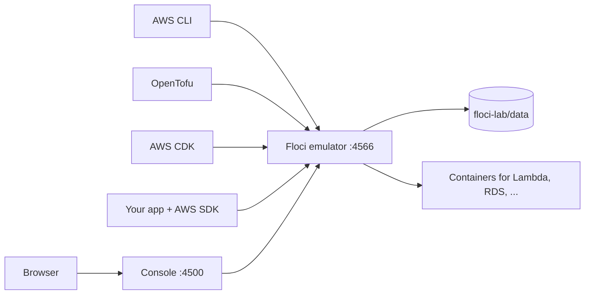

# Floci Test Bench — Usage Manual

This lab is a personal AWS test bench. Use it to learn AWS services, practice
infrastructure as code, and test application code with the AWS CLI or an AWS
SDK. Everything runs on your machine. No call reaches a real AWS account, and
nothing costs money.

For install, configuration, updates, and troubleshooting, read the
[README](README.md).

All recipes in this manual were tested on Floci emulator 2.1.0 and console
0.5.0.

## Contents

1. [How the bench works](#1-how-the-bench-works)
2. [Start and end a session](#2-start-and-end-a-session)
3. [Choose a way to work](#3-choose-a-way-to-work)
4. [Work with the AWS CLI](#4-work-with-the-aws-cli)
5. [Work with OpenTofu](#5-work-with-opentofu)
6. [Work with AWS CDK](#6-work-with-aws-cdk)
7. [Connect your own apps with an AWS SDK](#7-connect-your-own-apps-with-an-aws-sdk)
8. [Know what is real and what is a stub](#8-know-what-is-real-and-what-is-a-stub)
9. [Learning path](#9-learning-path)
10. [Keep the bench healthy](#10-keep-the-bench-healthy)
11. [Quick reference](#11-quick-reference)

---

## 1. How the bench works



| Part | Role |
| --- | --- |
| Floci emulator, `localhost:4566` | Answers AWS API calls. Uses the fake account `000000000000`. |
| Floci console, `localhost:4500` | Shows what exists in the emulator. |
| mise | Loads the lab environment when you enter the lab folder. Runs the lab tasks. |
| AWS CLI and OpenTofu | Installed and pinned by mise. Inside the lab folder, they use the emulator. |
| AWS CDK | Runs with `npx` from a CDK app folder. Inside the lab folder, it uses the emulator. |

### What "create" means in Floci

Floci does not create anything in AWS. It makes one of three things:

| Floci makes | For | Where it lives |
| --- | --- | --- |
| A record | Most resources: queues, messages, topics, tables, roles, parameters, VPCs | `floci-lab/data/<service>-<type>.wal` |
| A file | S3 object contents | `floci-lab/data/s3/.accounts/<account>/<bucket>/<key>.s3data` |
| A real container | Lambda, RDS, ElastiCache, MSK, MWAA, ECS, EKS, OpenSearch, DocumentDB, Redshift, ECR | Docker, on the `floci-net` network |

Records and files are fast and use almost no resources. Containers run the real
software, use memory in the Docker VM, and take seconds to start.

---

## 2. Start and end a session

1. Go to the lab folder:

   ```bash
   cd ~/Dev/personal/floci
   ```

2. Start the lab:

   ```bash
   mise run up
   ```

3. Make sure the lab is healthy:

   ```bash
   mise run health
   ```

   All three lines must show `OK`.

4. Make sure the lab environment is loaded:

   ```bash
   echo $AWS_PROFILE    # must show: floci
   ```

5. Open the console at `http://localhost:4500`.

To end the session, stop the lab:

```bash
mise run down
```

The data stays in `floci-lab/data`. The next `mise run up` starts with the same
resources.

---

## 3. Choose a way to work

| Goal | Use | Section |
| --- | --- | --- |
| Learn what a service does | AWS CLI | [4](#4-work-with-the-aws-cli) |
| Practice infrastructure as code | OpenTofu | [5](#5-work-with-opentofu) |
| Practice infrastructure as code in a programming language | AWS CDK | [6](#6-work-with-aws-cdk) |
| Test application code | An AWS SDK in your app | [7](#7-connect-your-own-apps-with-an-aws-sdk) |
| Follow guided exercises with a checker | [`floci-lab/exercises/`](floci-lab/exercises/README.md) | [9](#9-learning-path) |
| See the result | Console, `localhost:4500` | — |

Use the console to inspect, not to create. Create resources with the CLI,
OpenTofu, or code, the same way you work on real AWS.

A good order for each new service: learn it with the CLI, then describe it in
OpenTofu, then call it from an app.

---

## 4. Work with the AWS CLI

### Rules

- Run `aws` inside the lab folder or a subfolder. There, the CLI uses the
  `floci` profile and sends each call to the emulator.
- Outside the lab folder, the same command uses your real AWS account.
- Keep throwaway files in `floci-lab/scratch/`. Git ignores that folder, and the
  lab environment applies there.

> **Warning:** A script that runs from an IDE, cron, or a Git hook can run
> without mise. Then it uses your real AWS account. Pass `--profile floci` in
> every lab script. Without mise, that profile does not exist, so the command
> fails.

Before the recipes, go to the scratch folder:

```bash
mkdir -p floci-lab/scratch && cd floci-lab/scratch
```

### S3: upload and download

```bash
aws s3 mb s3://practice
echo "hello" | aws s3 cp - s3://practice/hello.txt
aws s3 cp s3://practice/hello.txt -
aws s3 rb s3://practice --force
```

### SQS: send and receive a message

```bash
Q=$(aws sqs create-queue --queue-name jobs --query QueueUrl --output text)
aws sqs send-message --queue-url "$Q" --message-body "job 1"
aws sqs receive-message --queue-url "$Q" --wait-time-seconds 5
aws sqs delete-queue --queue-url "$Q"
```

### SNS to SQS: fan-out

```bash
Q=$(aws sqs create-queue --queue-name orders --query QueueUrl --output text)
QARN=$(aws sqs get-queue-attributes --queue-url "$Q" \
  --attribute-names QueueArn --query Attributes.QueueArn --output text)
T=$(aws sns create-topic --name events --query TopicArn --output text)

aws sns subscribe --topic-arn "$T" --protocol sqs --notification-endpoint "$QARN"
aws sns publish --topic-arn "$T" --message "order created"
aws sqs receive-message --queue-url "$Q" --wait-time-seconds 5 \
  --query 'Messages[0].Body' --output text

aws sns delete-topic --topic-arn "$T"
aws sqs delete-queue --queue-url "$Q"
```

The message body is an SNS `Notification` JSON envelope, as on real AWS. To get
the plain message, add `--attributes RawMessageDelivery=true` to `subscribe`.

### DynamoDB: write and read an item

```bash
aws dynamodb create-table --table-name items \
  --attribute-definitions AttributeName=id,AttributeType=S \
  --key-schema AttributeName=id,KeyType=HASH \
  --billing-mode PAY_PER_REQUEST

aws dynamodb put-item --table-name items \
  --item '{"id":{"S":"1"},"name":{"S":"first"}}'
aws dynamodb get-item --table-name items --key '{"id":{"S":"1"}}'

aws dynamodb delete-table --table-name items
```

### Lambda: deploy and invoke a Python function

```bash
cat > handler.py <<'EOF'
def handler(event, context):
    return {"greeting": f"hello {event.get('name', 'world')}"}
EOF
zip function.zip handler.py

aws lambda create-function --function-name hello \
  --runtime python3.12 --handler handler.handler \
  --role arn:aws:iam::000000000000:role/lambda-role \
  --zip-file fileb://function.zip
aws lambda wait function-active-v2 --function-name hello

aws lambda invoke --function-name hello \
  --cli-binary-format raw-in-base64-out \
  --payload '{"name":"floci"}' out.json
cat out.json    # {"greeting": "hello floci"}

aws lambda delete-function --function-name hello
```

- The first invoke takes about 15 seconds, because Floci starts a container for
  the function. The next invokes are fast.
- The role in `--role` does not need to exist.
- Deleting the function also removes its container.

### Separate accounts

Floci reads a 12-digit access key as the account ID. Resources in one account
are invisible to another.

```bash
AWS_ACCESS_KEY_ID=111111111111 AWS_SECRET_ACCESS_KEY=test aws sqs create-queue --queue-name orders
AWS_ACCESS_KEY_ID=222222222222 AWS_SECRET_ACCESS_KEY=test aws sqs list-queues   # empty
```

Set both variables. Inside the lab, mise sets the secret key to an empty value,
and the CLI rejects an access key without a secret key.

---

## 5. Work with OpenTofu

`floci-lab/provider.tf` is ready. It sends each AWS service to the emulator,
uses dummy credentials, and keeps state in a local file.

> **Warning:** The provider has one endpoint line for each service it can use.
> A service without a line sends its calls to real AWS, and they fail. Add a
> line to the `endpoints` block before you use a new service.

### The practice loop

Run these commands in `floci-lab/`:

1. Write the resources in `main.tf`.
2. Preview the changes:

   ```bash
   tofu plan
   ```

3. Apply the changes:

   ```bash
   tofu apply
   ```

4. Prove that the system works with real traffic. For example, publish a
   message, upload a file, or invoke a function with the CLI.
5. Look at the result in the console.
   > **Warning:** On Floci 2.1.0, `force_destroy = true` does not end on an S3
   > bucket without versioning that holds objects. `tofu destroy` then runs
   > without end. Empty such a bucket before you destroy:
   > `aws s3 rm s3://<bucket> --recursive`. Buckets with versioning are not
   > affected.

6. Destroy the resources:

   ```bash
   tofu destroy
   ```

7. Apply again. If the second apply fails, the code has a real defect, often a
   hard-coded name or a missing dependency.

For a full example with S3, SQS, SNS, and DynamoDB, read
[Workflow: build infrastructure](README.md#workflow-build-infrastructure).

### Separate exercise folders

Give each exercise its own folder and its own state. Then a broken exercise
does not block the others. The ready exercises in
[`floci-lab/exercises/`](floci-lab/exercises/) already use this layout.

`floci-lab/.terraform` must exist first. `mise run install` or `tofu init` in
`floci-lab/` makes it.

1. Make the folder and copy the provider files:

   ```bash
   mkdir -p floci-lab/exercises/01-s3 && cd floci-lab/exercises/01-s3
   cp ../../provider.tf ../../.terraform.lock.hcl .
   ```

2. Initialize with the provider that is already downloaded (about 770 MB):

   ```bash
   tofu init -plugin-dir=../../.terraform/providers
   ```

Git ignores `.terraform/` and state files in every folder.

### Drills

| Drill | Do this | Learn |
| --- | --- | --- |
| Drift | Change a resource with the CLI. Run `tofu plan`. | How tofu detects changes made outside the code. |
| Lost state | Delete `terraform.tfstate`. Rebuild it with `tofu import`. | What state is and how to recover it. |
| Broken wiring | Give a subscription a wrong queue ARN. Predict the plan, then run it. | How references connect resources. |
| Rename | Rename a resource block. Read the plan. | Why a rename destroys and creates, and how `moved` blocks stop it. |

---

## 6. Work with AWS CDK

AWS CDK describes infrastructure in TypeScript, Python, Java, Go, or C#. CDK
compiles the code to a CloudFormation template, and Floci's CloudFormation
deploys it. The normal `cdk` CLI works with the bench. You do not need a
wrapper such as `cdklocal`.

Tested with two version pairs: CDK CLI 2.1135.1 with `aws-cdk-lib` 2.264.0
(the pair that Floci's own CI uses), and CDK CLI 2.1141.0 with `aws-cdk-lib`
2.269.0. A TypeScript app with S3, SQS, SNS, DynamoDB, and a Lambda from a code
asset passed bootstrap, deploy, diff, update, hotswap, destroy, and redeploy.

### Where to put a CDK app

| Place | Configuration |
| --- | --- |
| Inside the lab, for example `floci-lab/cdk/<app>/` | None. The lab profile points CDK at the emulator. |
| A folder or repository outside the lab | The five variables from [App on your Mac](#app-on-your-mac). |

> **Warning:** Outside the lab, without those variables, `cdk deploy` uses your
> real AWS account.

### Create an app

CDK needs Node.js. The lab does not pin it. On this machine, the global mise
configuration provides Node 24.

1. Make a folder for the app:

   ```bash
   mkdir -p floci-lab/cdk/hello && cd floci-lab/cdk/hello
   ```

2. Generate the project:

   ```bash
   npx aws-cdk@latest init app --language typescript --generate-only
   npm install
   ```

   `--generate-only` skips `git init`. Without the flag, CDK makes a second Git
   repository inside the lab. The generated `.gitignore` covers `node_modules`
   and `cdk.out`.

3. Write the stack in `lib/hello-stack.ts`. Example:

   ```typescript
   import * as cdk from 'aws-cdk-lib/core';
   import { Construct } from 'constructs';
   import * as sqs from 'aws-cdk-lib/aws-sqs';
   import * as sns from 'aws-cdk-lib/aws-sns';
   import * as subs from 'aws-cdk-lib/aws-sns-subscriptions';
   import * as dynamodb from 'aws-cdk-lib/aws-dynamodb';
   import * as lambda from 'aws-cdk-lib/aws-lambda';
   import * as logs from 'aws-cdk-lib/aws-logs';

   export class HelloStack extends cdk.Stack {
     constructor(scope: Construct, id: string, props?: cdk.StackProps) {
       super(scope, id, props);

       const queue = new sqs.Queue(this, 'Orders', { queueName: 'hello-orders' });
       const topic = new sns.Topic(this, 'Events', { topicName: 'hello-events' });
       topic.addSubscription(new subs.SqsSubscription(queue, { rawMessageDelivery: true }));

       const table = new dynamodb.Table(this, 'Items', {
         tableName: 'hello-items',
         partitionKey: { name: 'id', type: dynamodb.AttributeType.STRING },
         billingMode: dynamodb.BillingMode.PAY_PER_REQUEST,
         removalPolicy: cdk.RemovalPolicy.DESTROY,
       });

       // Deleted with the stack. See "Redeploy fails: log group already exists".
       const logGroup = new logs.LogGroup(this, 'WriterLogs', {
         logGroupName: '/aws/lambda/hello-writer',
         removalPolicy: cdk.RemovalPolicy.DESTROY,
       });

       const fn = new lambda.Function(this, 'Writer', {
         functionName: 'hello-writer',
         logGroup,
         runtime: lambda.Runtime.PYTHON_3_12,
         handler: 'index.handler',
         code: lambda.Code.fromAsset('lambda'),   // folder with index.py
         environment: { TABLE_NAME: table.tableName },
       });
       table.grantWriteData(fn);
     }
   }
   ```

4. Write the function in `lambda/index.py`:

   ```python
   import os, uuid, boto3

   table = boto3.resource("dynamodb").Table(os.environ["TABLE_NAME"])

   def handler(event, context):
       item = {"id": str(uuid.uuid4()), "source": "cdk"}
       table.put_item(Item=item)
       return item
   ```

   The function needs no endpoint. Floci gives each Lambda container the
   emulator address.

If a newer CDK version fails on Floci, pin a tested version pair in
`package.json`.

### Bootstrap the emulator

Run this one time for each emulator. Run it again after `mise run reset` or
`mise run flush`.

```bash
npx cdk bootstrap
```

It creates the `CDKToolkit` stack: an S3 bucket for code assets, an ECR
repository, IAM roles, and an SSM parameter. The output must show
`aws://000000000000/us-east-1 bootstrapped`.

### The CDK loop

| Step | Command | Result |
| --- | --- | --- |
| Compile | `npx cdk synth` | Writes the CloudFormation template to `cdk.out/`. Makes no AWS calls. |
| Compare | `npx cdk diff` | Shows the changes against the deployed stack. |
| Deploy | `npx cdk deploy` | Uploads the assets and deploys the stack. Add `--require-approval never` to skip the prompt. |
| Fast code update | `npx cdk deploy --hotswap` | Updates only Lambda code, in about one second. |
| Delete | `npx cdk destroy` | Deletes the stack. |

After a deploy, test the resources with the recipes in
[Work with the AWS CLI](#4-work-with-the-aws-cli).

`--hotswap` changes the function outside CloudFormation. CDK then asks you to
add `--revert-drift` to the next full deploy. Use hotswap only while you work
on code.

### Clean up

1. Delete the app stack:

   ```bash
   npx cdk destroy
   ```

2. To remove the bootstrap too, empty the asset bucket and delete the stack:

   ```bash
   B=$(aws cloudformation describe-stacks --stack-name CDKToolkit \
     --query "Stacks[0].Outputs[?OutputKey=='BucketName'].OutputValue" --output text)
   aws s3 rm "s3://$B" --recursive
   aws cloudformation delete-stack --stack-name CDKToolkit
   aws cloudformation wait stack-delete-complete --stack-name CDKToolkit
   aws s3 rb "s3://$B"
   ```

   The bootstrap template keeps the asset bucket when the stack is deleted, as
   on real AWS. The last command deletes it.

### Redeploy fails: log group already exists

A deploy can fail with this error:

```
CREATE_FAILED | AWS::Logs::LogGroup | The specified log group already exists: /aws/lambda/<function>
```

The stack then shows `ROLLBACK_COMPLETE`. There are two causes:

- Recent `aws-cdk-lib` versions make a log group for each function, with
  `DeletionPolicy: Retain`. `cdk destroy` keeps that log group. The next deploy
  with the same function name then fails.
- Lambda makes the log group itself at the first invoke. A stack from an older
  CDK version leaves that log group behind in the same way.

Real AWS fails in the same way. To fix it:

1. Delete the failed stack. CloudFormation cannot update a stack in
   `ROLLBACK_COMPLETE`:

   ```bash
   aws cloudformation delete-stack --stack-name <stack>
   aws cloudformation wait stack-delete-complete --stack-name <stack>
   ```

2. Delete the old log group:

   ```bash
   aws logs delete-log-group --log-group-name /aws/lambda/<function>
   ```

3. Give each function an explicit log group with
   `removalPolicy: cdk.RemovalPolicy.DESTROY`, as the example does. Then
   `cdk destroy` deletes it.

### Limits

- **IAM grants are not enforced.** `grantWriteData` creates a correct policy,
  but Floci does not check it. A missing grant still works here.
- **Unsupported resource types still succeed.** Floci's CloudFormation docs say
  such a resource reaches `CREATE_COMPLETE`, but nothing is created. If a
  resource seems missing, read the stack events:

  ```bash
  aws cloudformation describe-stack-events --stack-name <stack>
  ```

---

## 7. Connect your own apps with an AWS SDK

Any AWS SDK works with the emulator. Configure the app with environment
variables. Then the app code stays the same as for real AWS.

### App on your Mac

Give the app its own environment in its own folder. Example for the app's
`mise.toml`:

```toml
[env]
AWS_ENDPOINT_URL      = "http://localhost:4566"
AWS_REGION            = "us-east-1"
AWS_DEFAULT_REGION    = "us-east-1"   # boto3 reads only this one
AWS_ACCESS_KEY_ID     = "test"
AWS_SECRET_ACCESS_KEY = "test"
```

> **Warning:** Set all five variables together. With only the endpoint, the SDK
> takes your real keys from `~/.aws`. With only the keys, the calls go to real
> AWS and fail.

The app code has no Floci settings. This Python app was tested from a folder
outside the lab:

```python
import boto3

sqs = boto3.client("sqs")
url = sqs.create_queue(QueueName="orders")["QueueUrl"]
sqs.send_message(QueueUrl=url, MessageBody="hello")
print(sqs.receive_message(QueueUrl=url, WaitTimeSeconds=2)["Messages"][0]["Body"])
```

Older SDK versions can ignore `AWS_ENDPOINT_URL`. Then set the endpoint in the
client code, as the
[Floci SDK setup page](https://github.com/floci-io/floci/blob/main/docs/getting-started/aws-setup.md)
shows.

### App in a Docker container

Inside a container, `localhost` is the container itself. Connect the container
to the lab network, and use the emulator service name:

```yaml
services:
  my-app:
    environment:
      AWS_ENDPOINT_URL: http://floci:4566
      AWS_REGION: us-east-1
      AWS_DEFAULT_REGION: us-east-1
      AWS_ACCESS_KEY_ID: test
      AWS_SECRET_ACCESS_KEY: test
    networks: [floci-net]

networks:
  floci-net:
    external: true
```

The lab console uses this method to reach the emulator.

For S3 in a container, turn on path-style addresses in the SDK:

| SDK | Setting |
| --- | --- |
| JavaScript v3 | `forcePathStyle: true` |
| Go v2 | `o.UsePathStyle = true` |
| Java v2 | `.forcePathStyle(true)` |
| Python boto3 | `Config(s3={"addressing_style": "path"})` |

On your Mac, S3 works without this setting.

### Automated tests

Do not point automated tests at the lab. Test data then mixes with your practice
data. Use a Testcontainers module instead. It starts a new emulator for each
test run:

- [Java](https://github.com/floci-io/testcontainers-floci)
- [Go](https://github.com/floci-io/testcontainers-floci-go)
- [.NET](https://github.com/floci-io/testcontainers-floci-dotnet)
- [Python](https://github.com/floci-io/testcontainers-floci-python)
- [Node](https://github.com/floci-io/testcontainers-floci-node)

### Keep apps apart

Give each app its own 12-digit access key, for example `111111111111` and
`222222222222`. Each app then sees only its own resources in the shared
emulator.

---

## 8. Know what is real and what is a stub

Floci imitates AWS. The depth of the imitation changes from service to service.

| Level | What you get | Examples |
| --- | --- | --- |
| Emulated behavior | Resources act like AWS: messages move, items persist, objects store bytes. | S3, SQS, SNS, DynamoDB |
| Real engine | Floci starts the real software in a container. | Lambda, RDS, ElastiCache, ECS, EKS, OpenSearch |
| Stub | Responses have the correct shape, but no real work happens. | Transcribe, Bedrock Runtime |
| Not implemented | The call fails with `UnknownOperationException`. | `aws bedrock list-foundation-models` |

Before you depend on a service, read its page in the
[Floci service docs](https://github.com/floci-io/floci/tree/main/docs/services).

### Stub examples

| Call | Result |
| --- | --- |
| `aws transcribe start-transcription-job` | `COMPLETED` at once, even when the audio file does not exist. The transcript file is never created. |
| `aws bedrock-runtime converse` | Always `"Floci stub response for model=<model>"`, with the same token counts. |

Stubs are good for testing the flow of your code: request shapes, job status,
error handling, and IAM wiring. They cannot give real transcripts or real model
answers.

### Real text from Bedrock

The emulator can forward `converse` and `converse-stream` calls to an
OpenAI-compatible server, for example Ollama. Add these variables to the `floci`
service in `floci-lab/docker-compose.yml`, then run `mise run restart`:

```yaml
FLOCI_SERVICES_BEDROCK_RUNTIME_BACKEND: proxy
FLOCI_SERVICES_BEDROCK_RUNTIME_PROXY_URL: http://<ollama-host>:11434/v1
FLOCI_SERVICES_BEDROCK_RUNTIME_PROXY_DEFAULT_MODEL: llama3.2
```

The answers then come from that model, not from Claude. `invoke-model` still
returns the stub response.

### What the bench cannot teach

- **IAM least privilege.** Floci does not fully enforce IAM policies. A wrong
  policy can still work here. Test security on a real account.
- **Cost, quotas, latency, and failure under load.** These do not exist in the
  emulator.

Keep a small real AWS account for these topics.

---

## 9. Learning path

Do the levels in order. For each level, use the CLI first, then OpenTofu, then
an app with an SDK.

Each level is a ready exercise in
[`floci-lab/exercises/`](floci-lab/exercises/), with starter code, a checker,
and a solution. The [exercises guide](floci-lab/exercises/README.md) explains
how they are organized and how to use them.

| Level | Build | Learn |
| --- | --- | --- |
| 1. Basics | S3 bucket with versioning and a lifecycle rule | `plan`, `apply`, `destroy`, state, outputs |
| 2. Messaging | SNS topic to two SQS queues, with a dead-letter queue | Resource wiring, queue policies, retries |
| 3. Serverless API | API Gateway to Lambda to DynamoDB | Lambda packaging, IAM roles, CloudWatch Logs |
| 4. Event-driven | S3 upload to EventBridge to SQS to EventBridge Pipes to Step Functions, which calls Lambda and DynamoDB | Event patterns, orchestration, end-to-end tests |
| 5. Reusable code | A queue-with-dead-letter-queue module, used with `for_each` | Module design, input validation, `tofu test` |
| 6. Containers | A custom image in ECR, run as an ECS service on a host port | Container workloads. Floci runs real containers here, so it is slower. |

Do the drills at any level. The [drills folder](floci-lab/exercises/drills/)
has four of them, ready to run.

---

## 10. Keep the bench healthy

| When | Run | Result |
| --- | --- | --- |
| Before a risky experiment | `mise run backup` | Saves data and pins to `floci-lab/backups/`. |
| After a failed experiment | `mise run rollback` | Restores the newest backup. Data written after it is lost. |
| For an empty emulator | `mise run reset` | Deletes all emulator data. Keeps backups. |
| For a completely clean bench | `mise run flush` | Deletes emulator data, backups, and the containers and volumes Floci made. Asks first. |
| Every few weeks | `mise run outdated` | Shows new Floci releases. Changes nothing. |
| To update Floci | `mise run upgrade` | See [Updates](README.md#updates). |
| The Mac feels slow | `mise run status` | Lists the containers. Delete the resources you do not need. |

`mise run reset` does not delete OpenTofu state. Run `tofu destroy` first, or
delete the state files. Otherwise the state lists resources that no longer
exist.

---

## 11. Quick reference

| I want to | Run |
| --- | --- |
| Start the bench | `mise run up` |
| Check the bench | `mise run health` |
| Stop the bench | `mise run down` |
| Make sure the CLI uses the lab | `echo $AWS_PROFILE` shows `floci` |
| Check the account | `aws sts get-caller-identity` shows `000000000000` |
| Open the console | `http://localhost:4500` |
| Follow emulator logs | `mise run logs` |
| Save a restore point | `mise run backup` |
| Go back to the restore point | `mise run rollback` |
| Delete all emulator data | `mise run reset` |
| Delete data, backups, and Floci containers | `mise run flush` |
| Check for updates | `mise run outdated` |
| List all tasks | `mise tasks` |
| Prepare the emulator for CDK | `npx cdk bootstrap` in a CDK app folder |
| Deploy a CDK app | `npx cdk deploy` |
| Delete a CDK app | `npx cdk destroy` |

| Endpoint | Use from |
| --- | --- |
| `http://localhost:4566` | The CLI, OpenTofu, and apps on your Mac |
| `http://floci:4566` | Containers on the `floci-net` network |
| `http://localhost:4500` | Your browser |
