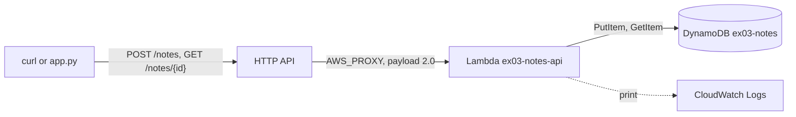

# Exercise 03 — Serverless API

| Level | Services | Time |
| --- | --- | --- |
| 3 | API Gateway (HTTP API), Lambda, DynamoDB, IAM, CloudWatch Logs | 60–90 minutes |

## Goal

Build a small notes API. A client sends HTTP requests to API Gateway. API
Gateway invokes a Python Lambda function, and the function stores the notes in
a DynamoDB table.



## What you learn

- How to package a Lambda function with `archive_file` and `source_code_hash`.
- How an execution role, its trust policy, and its permission policies work
  together.
- How an HTTP API sends a request to Lambda: integration, route, and stage.
- Why API Gateway needs a permission on the function.
- How to read function logs in CloudWatch Logs.
- Where Floci is less strict than AWS: roles, IAM policies, and Lambda
  permissions.

## Before you start

1. Make sure the lab runs:

   ```bash
   mise run health
   ```

2. Go to this folder:

   ```bash
   cd floci-lab/exercises/03-serverless-api
   ```

> **Note:** Floci runs each Lambda function in a Docker container on your
> machine. Each container uses memory. Delete your functions at the end of each
> part.

---

## Part A — Explore with the AWS CLI

Deploy a function by hand. Then put an HTTP API in front of it.

Use one terminal for all steps. Step 4 sets the variable `API_ID`. Later steps
use it.

1. Write a small handler and zip it:

   ```bash
   cat > hello.py <<'EOF'
   import json


   def handler(event, context):
       print("path:", event.get("rawPath"))
       return {"statusCode": 200, "body": json.dumps({"message": "Hello from Lambda"})}
   EOF
   zip hello.zip hello.py
   ```

2. Create the function. Then wait until it is active:

   ```bash
   aws lambda create-function --function-name ex03-cli-hello \
     --runtime python3.12 --handler hello.handler \
     --role arn:aws:iam::000000000000:role/ex03-cli-role \
     --zip-file fileb://hello.zip
   aws lambda wait function-active-v2 --function-name ex03-cli-hello
   ```

   > **Note:** The role `ex03-cli-role` does not exist. Floci accepts the ARN.
   > Real AWS rejects a role that Lambda cannot assume. Part B creates a real
   > role.

3. Invoke the function directly, without API Gateway:

   ```bash
   aws lambda invoke --function-name ex03-cli-hello \
     --cli-binary-format raw-in-base64-out \
     --payload '{"rawPath": "/direct"}' out.json
   cat out.json
   ```

   **Question:** The CLI prints `"StatusCode": 200`. The file `out.json` also
   contains `"statusCode": 200`. Which of the two values comes from your code?

4. Create an HTTP API with quick create. The `--target` option makes a route, a
   Lambda integration, and a stage in one call:

   ```bash
   API_ID=$(aws apigatewayv2 create-api --name ex03-cli-quick --protocol-type HTTP \
     --target arn:aws:lambda:us-east-1:000000000000:function:ex03-cli-hello \
     --query ApiId --output text)
   echo "$API_ID"
   ```

5. Look at the parts that quick create made:

   ```bash
   aws apigatewayv2 get-routes --api-id "$API_ID" \
     --query 'Items[].[RouteKey,Target]' --output table
   aws apigatewayv2 get-integrations --api-id "$API_ID" \
     --query 'Items[].[IntegrationId,IntegrationType,PayloadFormatVersion]' --output table
   aws apigatewayv2 get-stages --api-id "$API_ID" \
     --query 'Items[].[StageName,AutoDeploy]' --output table
   ```

6. Give API Gateway permission to invoke the function:

   ```bash
   aws lambda add-permission --function-name ex03-cli-hello \
     --statement-id allow-apigateway --action lambda:InvokeFunction \
     --principal apigateway.amazonaws.com \
     --source-arn "arn:aws:execute-api:us-east-1:000000000000:$API_ID/*"
   ```

   > **Note:** Floci also invokes the function without this permission. Real
   > AWS does not invoke it, and the API returns `500`. Always add the
   > permission.

7. Call the API on two different paths:

   ```bash
   curl -i "http://$API_ID.execute-api.localhost.floci.io:4566/hello"
   curl -i "http://$API_ID.execute-api.localhost.floci.io:4566/any/other/path"
   ```

   **Question:** You did not create a route for these paths. Why does the
   function answer both?

   > **Note:** On real AWS, the URL is
   > `https://<api-id>.execute-api.<region>.amazonaws.com/`. Floci serves HTTP
   > APIs at `http://<api-id>.execute-api.localhost.floci.io:4566/`. The name
   > `localhost.floci.io` and all its subdomains resolve to `127.0.0.1`.

8. Read the function logs:

   ```bash
   aws logs tail /aws/lambda/ex03-cli-hello
   ```

   The output has one `path:` line for each call. Lambda created the log group
   at the first invocation.

   > **Note:** Floci stores only the lines that your code prints. Real AWS also
   > adds a `START`, an `END`, and a `REPORT` line for each invocation.

9. Delete the resources and the files:

   ```bash
   aws apigatewayv2 delete-api --api-id "$API_ID"
   aws lambda delete-function --function-name ex03-cli-hello
   aws logs delete-log-group --log-group-name /aws/lambda/ex03-cli-hello
   rm hello.py hello.zip out.json
   ```

   **Question:** Why must you delete the log group with a separate command?

---

## Part B — Build with OpenTofu

1. Initialize OpenTofu. The flag reuses the provider that the lab already
   downloaded:

   ```bash
   tofu init -plugin-dir=../../.terraform/providers
   ```

2. Open `lambda/handler.py`. Complete TODO 1 to TODO 3.
3. Open `main.tf`. Complete TODO 1 to TODO 10.
4. Preview the changes after each TODO:

   ```bash
   tofu plan
   ```

5. Apply the changes:

   ```bash
   tofu apply
   ```

6. Read the outputs:

   ```bash
   tofu output
   ```

   **Question:** `api_endpoint` and `invoke_url` are different. Which one works
   from your machine?

   > **Note:** On Floci, `api_endpoint` has the real AWS host name, for example
   > `https://<api-id>.execute-api.us-east-1.amazonaws.com`. That name does not
   > resolve, so `curl` fails with `Could not resolve host`. On a real account,
   > use `api_endpoint`, or `invoke_url` of the stage. In this lab, use the
   > `invoke_url` output.

7. Create a note:

   ```bash
   URL=$(tofu output -raw invoke_url)
   curl -i -X POST "$URL/notes" -H 'Content-Type: application/json' -d '{"text": "Hello, API"}'
   ```

   The response is `201 Created` and the new note with its `id`.

8. Read the note. Replace `<note-id>` with the `id` from step 7:

   ```bash
   curl -i "$URL/notes/<note-id>"
   ```

   The response is `200 OK` and the same note. Change one character of the ID
   and send the request again. The response is `404 Not Found`.

9. Read the function logs:

   ```bash
   aws logs tail /aws/lambda/ex03-notes-api
   ```

   The output has one line with the route and the status code for each request.

10. Ask IAM what the role can do:

    ```bash
    aws iam simulate-principal-policy \
      --policy-source-arn arn:aws:iam::000000000000:role/ex03-notes-api-role \
      --action-names dynamodb:PutItem dynamodb:GetItem dynamodb:DeleteItem \
      --resource-arns arn:aws:dynamodb:us-east-1:000000000000:table/ex03-notes \
      --query 'EvaluationResults[].[EvalActionName,EvalDecision]' --output table
    ```

    `PutItem` and `GetItem` show `allowed`. `DeleteItem` shows `implicitDeny`.

    > **Note:** Floci does not enforce IAM policies in this lab. In a test, a
    > `Deny` on `dynamodb:*` did not stop the function. It still wrote to the
    > table. Real AWS denies the call, and the function fails. To test a policy
    > here, use `simulate-principal-policy`.

11. Run `tofu plan` again. It must show `No changes`.

---

## Part C — Use it from code

1. Open `app.py`. Complete TODO 1 to TODO 4.
2. Run the app. The argument gives the invoke URL to the app:

   ```bash
   uv run --with boto3 python app.py "$(tofu output -raw invoke_url)"
   ```

   The output must show `201` for each `POST`, `200` for each `GET`, and `404`
   for `does-not-exist`. The table list must show `Buy milk` and
   `Learn Lambda`. It also shows the note from Part B.

3. Run the app a second time. **Question:** How many items does the table hold
   now? Why does the second run not replace the notes from the first run?

---

## Check your work

```bash
./check.sh
```

The checker reads the emulator and calls the live API. It does not read your
files. It creates one note and deletes it at the end. All checks must show
`PASS`.

---

## Clean up

1. Destroy the resources:

   ```bash
   tofu destroy
   ```

2. Make sure that no function container is left. The command must show no
   names:

   ```bash
   docker ps --filter name=floci-ex03 --format '{{.Names}}'
   ```

3. Delete the zip file that `archive_file` made:

   ```bash
   rm -rf build
   ```

**Question:** In Part A, you deleted the log group with a separate command. Why
does `tofu destroy` delete the log group of `ex03-notes-api`?

---

## Stretch goals

- Add the route `GET /notes`. It returns all notes with `scan`. Add only
  `dynamodb:Scan` to the policy.
- Add a `cors_configuration` block to the API that allows the origin
  `http://localhost:8080`. Send a preflight request with `curl -i -X OPTIONS`,
  an `Origin` header, and an `Access-Control-Request-Method` header. Find
  `Access-Control-Allow-Origin` in the response.
- Pin the API ID with the tag `floci:override-id`. The `invoke_url` then stays
  the same after `tofu destroy` and `tofu apply`. Read the hint about this tag
  first.
- Replace the managed policy `AWSLambdaBasicExecutionRole` with an inline
  policy. Allow only `logs:CreateLogStream` and `logs:PutLogEvents` on
  `"${aws_cloudwatch_log_group.<name>.arn}:*"`.
- Return `400` when `text` has more than 500 characters. Add this case to
  `app.py`.

---

## Hints

<details>
<summary>tofu init fails: the provider is not in the plugin directory</summary>

The lab provider is not downloaded yet. Run `tofu init` in `floci-lab/` once,
or run `mise run install`. Then run the init command of this exercise again.

</details>

<details>
<summary>curl returns XML with NoSuchBucket or "POST on bucket requires ?delete parameter"</summary>

The API has no `$default` stage. Floci then does not send the request to the
API. S3 answers instead. Complete TODO 8: add the stage with
`name = "$default"` and `auto_deploy = true`.

</details>

<details>
<summary>The API returns 404 with {"message":"Not Found"}</summary>

No route matches the method and the path. The route keys must be exactly
`POST /notes` and `GET /notes/{id}`. List the routes of your API:

```bash
aws apigatewayv2 get-routes --api-id "$(tofu output -raw api_id)" --query 'Items[].RouteKey'
```

A `404` from your handler is different. It has the message that your code
sets.

</details>

<details>
<summary>The API returns 501 with "TODO 2 is not complete."</summary>

The function still runs the starter code. Complete TODO 2 and TODO 3 in
`lambda/handler.py`, then run `tofu apply`. The zip gets a new hash, so
OpenTofu uploads the new code.

</details>

<details>
<summary>The API returns 502 with an empty body</summary>

The function raised an exception. Read the error in the logs:

```bash
aws logs tail /aws/lambda/ex03-notes-api
```

In this lab, a function without `TABLE_NAME` logged `KeyError: 'TABLE_NAME'`.
A wrong table name logged `ResourceNotFoundException`.

> **Note:** For a function error, real AWS returns `500` with
> `{"message":"Internal Server Error"}`. Floci returns `502` with an empty body.

</details>

<details>
<summary>tofu apply fails with ResourceAlreadyExistsException for the log group</summary>

The function ran before OpenTofu created the log group. Lambda then created the
log group itself, with no retention. Use one of these fixes:

- Import the log group into the state, then run `tofu apply`. The logs stay:

  ```bash
  tofu import aws_cloudwatch_log_group.<name> /aws/lambda/ex03-notes-api
  ```

- Delete the log group, then run `tofu apply`. The logs are lost:

  ```bash
  aws logs delete-log-group --log-group-name /aws/lambda/ex03-notes-api
  ```

To prevent this problem, create the log group before the function. The
`depends_on` in TODO 6 makes OpenTofu create the log group first in each apply.

</details>

<details>
<summary>check.sh: "The function role exists in IAM" fails</summary>

Floci accepts a role ARN that does not exist, as you saw in Part A. Set
`role = aws_iam_role.<name>.arn` on the function. Do not type the ARN.

</details>

<details>
<summary>check.sh: "The role does not allow dynamodb:DeleteItem" fails</summary>

The policy allows too much, for example `dynamodb:*`. Allow only
`dynamodb:GetItem` and `dynamodb:PutItem`, and use the table ARN as the
resource.

</details>

<details>
<summary>The source_arn of the permission has no account ID</summary>

The state shows an ARN such as `arn:aws:execute-api:us-east-1::<api-id>/*`. The
lab provider sets `skip_requesting_account_id = true`, so the provider does not
know the account ID. It leaves the account field of `execution_arn` empty.
Floci does not check the permission, so the API still works. On a real account,
the provider knows the account ID, and the ARN is complete.

</details>

<details>
<summary>Stretch goal: the tag floci:override-id makes tofu plan show a change every time</summary>

Floci uses the tag value as the API ID and does not keep the tag. At each plan,
OpenTofu sees that the tag is missing. Tell OpenTofu to ignore this tag:

```hcl
lifecycle {
  ignore_changes = [tags["floci:override-id"], tags_all["floci:override-id"]]
}
```

</details>

<details>
<summary>check.sh: "The table holds the notes 'Buy milk' and 'Learn Lambda'" fails</summary>

Run Part C. The checker looks for the notes that `app.py` creates.

</details>

---

## Solution

Try the exercise first. The solution is in [`solution/`](solution/).

To run the solution, destroy your own resources first. Both use the same names.

```bash
cd solution
tofu init -plugin-dir=../../../.terraform/providers
tofu apply
uv run --with boto3 python app.py "$(tofu output -raw invoke_url)"
../check.sh
tofu destroy
rm -rf build
```
