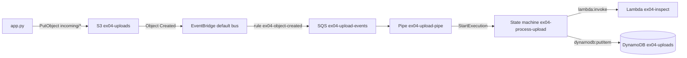
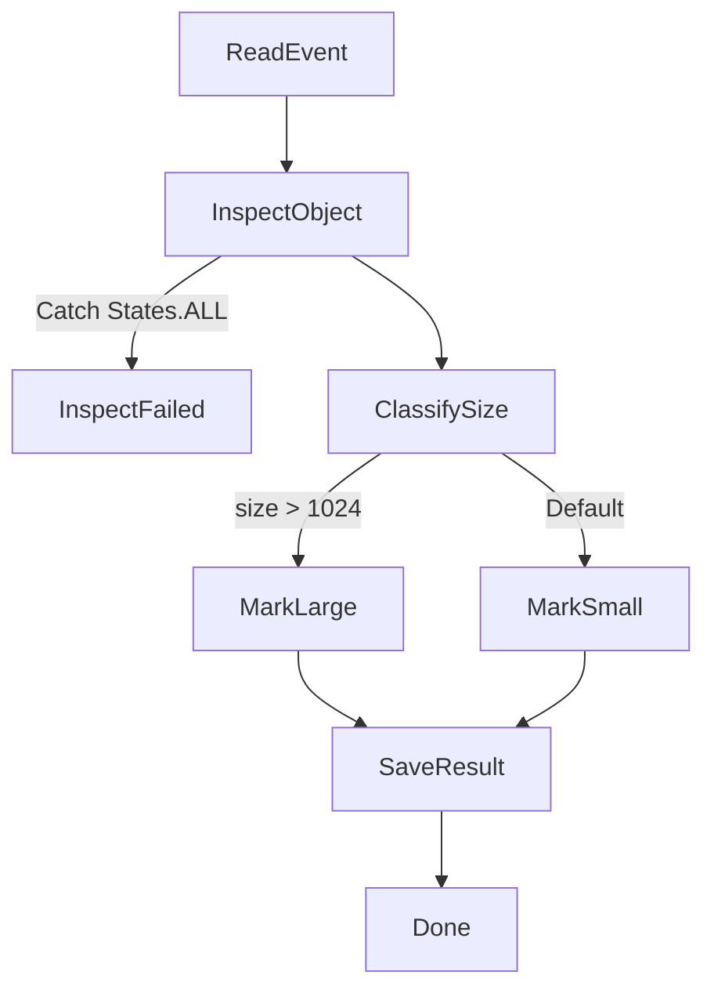

# Exercise 04 — Event-driven

| Level | Services | Time |
| --- | --- | --- |
| 4 | S3, EventBridge, SQS, EventBridge Pipes, Step Functions, Lambda, DynamoDB, IAM | 90–120 minutes |

## Goal

Build a workflow that starts when a file arrives. An upload to a bucket sends
an event. A Step Functions workflow inspects the file with a Lambda function,
classifies it as small or large, and stores the result in a DynamoDB table.
Your code only uploads files. No code of yours starts the workflow.



> **Note:** On real AWS, a rule can start a state machine directly. Floci 2.1.0
> does not support this target. `put-targets` accepts the state machine ARN,
> but no execution starts. The emulator log shows
> `EventBridge: unsupported target ARN type`. This exercise puts a queue and a
> pipe between the rule and the state machine. The queue also keeps the events
> while the pipe is stopped. Part B shows this.

## What you learn

- How S3 sends events to EventBridge, and what an S3 event looks like.
- Event patterns with content filters, and how to test a pattern without
  events.
- Rule targets, and the queue policy that lets a rule send to a queue.
- How an EventBridge Pipe connects a queue to a state machine without code.
- Step Functions states: `Pass`, `Task`, `Choice`, `Fail`, and `Succeed`.
- `Retry` and `Catch`, and how to find a failure in the execution history.
- Service integrations: `lambda:invoke` and `dynamodb:putItem`.
- An end-to-end test: upload a file, wait for the workflow, read the result.

## Before you start

1. Make sure the lab runs:

   ```bash
   mise run health
   ```

2. Go to this folder:

   ```bash
   cd floci-lab/exercises/04-event-driven
   ```

> **Note:** Floci runs each Lambda function in a Docker container on your
> machine. Each container uses memory. Destroy the resources at the end of the
> exercise.

---

## Part A — Explore with the AWS CLI

Send events to a rule, test a pattern, and run a small state machine. Use one
terminal for all steps. The steps keep ARNs and URLs in shell variables.

1. Create a queue. The rules in this part send the matched events to it:

   ```bash
   QUEUE_URL=$(aws sqs create-queue --queue-name ex04-cli-events --query QueueUrl --output text)
   QUEUE_ARN=$(aws sqs get-queue-attributes --queue-url "$QUEUE_URL" \
     --attribute-names QueueArn --query Attributes.QueueArn --output text)
   ```

2. Write an event pattern. It matches express orders from the shop:

   ```bash
   PATTERN='{"source": ["ex04.shop"], "detail-type": ["Order Placed"], "detail": {"shipping": ["express"]}}'
   ```

3. Test the pattern with two sample events. The command sends no event:

   ```bash
   aws events test-event-pattern --event-pattern "$PATTERN" --event '{
     "id": "1", "account": "000000000000", "time": "2026-01-01T12:00:00Z",
     "region": "us-east-1", "resources": [],
     "source": "ex04.shop", "detail-type": "Order Placed",
     "detail": {"order_id": "A1", "shipping": "express"}
   }'
   aws events test-event-pattern --event-pattern "$PATTERN" --event '{
     "id": "2", "account": "000000000000", "time": "2026-01-01T12:00:00Z",
     "region": "us-east-1", "resources": [],
     "source": "ex04.shop", "detail-type": "Order Placed",
     "detail": {"order_id": "A2", "shipping": "standard"}
   }'
   ```

   The first result is `true`. The second result is `false`.

   > **Note:** Floci 2.1.0 does not support the `numeric` operator. In a test,
   > the pattern `{"total": [{"numeric": [">", 100]}]}` returned `false` for a
   > total of 250, and a rule with it delivered no event. Real AWS returns
   > `true`. In this lab, exact values and `prefix` worked in rules, and
   > `suffix` worked in `test-event-pattern`. Test other operators before you
   > use them.

4. Create a rule with the pattern on the default bus. Add the queue as the
   target:

   ```bash
   aws events put-rule --name ex04-cli-express --event-pattern "$PATTERN"
   aws events put-targets --rule ex04-cli-express --targets "Id=queue,Arn=$QUEUE_ARN"
   ```

5. Put the same two orders on the bus as real events. Then receive the
   messages:

   ```bash
   aws events put-events --entries '[
     {"Source": "ex04.shop", "DetailType": "Order Placed", "Detail": "{\"order_id\": \"A1\", \"shipping\": \"express\"}"},
     {"Source": "ex04.shop", "DetailType": "Order Placed", "Detail": "{\"order_id\": \"A2\", \"shipping\": \"standard\"}"}
   ]'
   aws sqs receive-message --queue-url "$QUEUE_URL" --max-number-of-messages 10 \
     --wait-time-seconds 5 --query 'Messages[].Body' --output text
   ```

   **Question:** EventBridge accepted two events. Why does the queue hold only
   order `A1`?

   > **Note:** You did not create a queue policy, but Floci delivered the
   > event. On real AWS, a rule cannot send to a queue without a queue policy
   > that allows it. Part B adds the queue policy.

6. Turn on EventBridge notifications for a bucket. Send its events to the
   queue, then upload a file:

   ```bash
   aws s3 mb s3://ex04-cli-drop
   aws s3api put-bucket-notification-configuration --bucket ex04-cli-drop \
     --notification-configuration '{"EventBridgeConfiguration": {}}'
   aws events put-rule --name ex04-cli-s3 --event-pattern \
     '{"source": ["aws.s3"], "detail-type": ["Object Created"], "detail": {"bucket": {"name": ["ex04-cli-drop"]}}}'
   aws events put-targets --rule ex04-cli-s3 --targets "Id=queue,Arn=$QUEUE_ARN"
   echo "hello" | aws s3 cp - s3://ex04-cli-drop/incoming/hello.txt
   aws sqs receive-message --queue-url "$QUEUE_URL" --wait-time-seconds 5 \
     --query 'Messages[0].Body' --output text | jq .
   ```

   **Question:** Which fields hold the bucket name, the object key, and the
   size? The rule and the state machine in Part B use these fields.

   > **Note:** On Floci, `resources` is empty, `requester` is `aws:emulator`,
   > and `reason` is `ObjectCreated:Put`. On real AWS, `resources` holds the
   > bucket ARN, `requester` is an account ID, and `reason` is `PutObject`.

7. Write a state machine with a `Pass` state and a `Succeed` state. The `Pass`
   state builds a message from the input:

   ```bash
   cat > hello.asl.json <<'EOF'
   {
     "StartAt": "Greet",
     "States": {
       "Greet": {
         "Type": "Pass",
         "Parameters": {
           "message.$": "States.Format('Hello, {}!', $.name)"
         },
         "Next": "Done"
       },
       "Done": {
         "Type": "Succeed"
       }
     }
   }
   EOF
   ```

8. Create the state machine and start an execution:

   ```bash
   SM_ARN=$(aws stepfunctions create-state-machine --name ex04-cli-hello \
     --definition file://hello.asl.json \
     --role-arn arn:aws:iam::000000000000:role/ex04-cli-role \
     --query stateMachineArn --output text)
   EXEC_ARN=$(aws stepfunctions start-execution --state-machine-arn "$SM_ARN" \
     --input '{"name": "Floci"}' --query executionArn --output text)
   aws stepfunctions describe-execution --execution-arn "$EXEC_ARN" \
     --query '{Status: status, Output: output}'
   ```

   The status is `SUCCEEDED`. The output is `{"message":"Hello, Floci!"}`.

   > **Note:** The role `ex04-cli-role` does not exist, but Floci created the
   > state machine. On real AWS, the role must exist and trust
   > `states.amazonaws.com`.

9. Read the execution history:

   ```bash
   aws stepfunctions get-execution-history --execution-arn "$EXEC_ARN" \
     --query 'events[].[id, type]' --output table
   ```

   **Question:** Which event holds the output of the `Greet` state? Find its
   output with a query:

   ```bash
   aws stepfunctions get-execution-history --execution-arn "$EXEC_ARN" \
     --query "events[?type=='PassStateExited'].stateExitedEventDetails.output" --output text
   ```

10. Delete the resources. A rule with targets cannot be deleted, so remove the
    targets first:

    ```bash
    aws events remove-targets --rule ex04-cli-express --ids queue
    aws events delete-rule --name ex04-cli-express
    aws events remove-targets --rule ex04-cli-s3 --ids queue
    aws events delete-rule --name ex04-cli-s3
    aws s3 rb s3://ex04-cli-drop --force
    aws sqs delete-queue --queue-url "$QUEUE_URL"
    aws stepfunctions delete-state-machine --state-machine-arn "$SM_ARN"
    rm hello.asl.json
    ```

---

## Part B — Build with OpenTofu

The state machine has these states. `ReadEvent` is complete in the starter
file.



1. Initialize OpenTofu. The flag reuses the provider that the lab already
   downloaded:

   ```bash
   tofu init -plugin-dir=../../.terraform/providers
   ```

2. Open `lambda/handler.py`. Complete TODO 1 and TODO 2.
3. Open `statemachine.asl.json`. The file is JSON and cannot hold comments.
   Complete these TODOs:

   - **TODO 1 — `InspectObject`:** Change the type to `Task`. Use the resource
     `arn:aws:states:::lambda:invoke`. Set `FunctionName` to `${function_arn}`.
     Send a `Payload` with `bucket` and `key` from `$.event.detail`. Set
     `OutputPath` to `$.Payload`. The state output is then the value that the
     handler returns.
   - **TODO 2 — errors:** Add a `Retry` to `InspectObject` for
     `Lambda.ServiceException`, `Lambda.AWSLambdaException`,
     `Lambda.SdkClientException`, and `Lambda.TooManyRequestsException`. Use 3
     attempts. Add a `Catch` for `States.ALL` with `"ResultPath": "$.error"`.
     It goes to a new `Fail` state `InspectFailed`.
   - **TODO 3 — `ClassifySize`:** Change the type to `Choice`. When `$.size` is
     more than 1024, go to `MarkLarge`. Otherwise, go to `MarkSmall`. Add the
     two `Pass` states. Each state writes `"large"` or `"small"` to
     `$.category` and goes to `SaveResult`.
   - **TODO 4 — `SaveResult`:** Change the type to `Task`. Use the resource
     `arn:aws:states:::dynamodb:putItem` and the table `${table_name}`. Store
     `object_key`, `bucket`, `size`, `content_type`, `first_line`, `category`,
     and `execution_name` (from `$$.Execution.Name`). Set `ResultPath` to
     `null`. The output of the execution then stays the result of the earlier
     states.

   > **Note:** `templatefile()` in `main.tf` replaces `${function_arn}` and
   > `${table_name}`. Do not use `${` for anything else in this file.

   > **Note:** On Floci, the pipe starts one execution for each message. The
   > input is one SQS record, and its `body` holds the S3 event as a string.
   > `ReadEvent` depends on this format. This lab could not test the format on
   > real AWS. Read about batches in the EventBridge Pipes documentation before
   > you use `ReadEvent` there.

4. Open `main.tf`. Complete TODO 1 to TODO 11.
5. Preview the changes after each TODO:

   ```bash
   tofu plan
   ```

6. Apply the changes. The queue and the queue policy each take about 25
   seconds to create:

   ```bash
   tofu apply
   ```

7. Read the outputs:

   ```bash
   tofu output
   ```

8. Upload a file by hand. Then list the executions. The first call to the
   function can take some seconds. Run `list-executions` again until the new
   execution shows `SUCCEEDED`:

   ```bash
   echo "hello from the CLI" | aws s3 cp - s3://ex04-uploads/incoming/hello.txt
   SM_ARN=$(tofu output -raw state_machine_arn)
   aws stepfunctions list-executions --state-machine-arn "$SM_ARN" \
     --query 'executions[].[name, status, startDate]' --output table
   ```

9. Read the result in the table and in the function logs:

   ```bash
   aws dynamodb get-item --table-name ex04-uploads \
     --key '{"object_key": {"S": "incoming/hello.txt"}}'
   aws logs tail /aws/lambda/ex04-inspect
   ```

10. Read the history of the newest execution:

    ```bash
    EXEC_ARN=$(aws stepfunctions list-executions --state-machine-arn "$SM_ARN" \
      --query 'sort_by(executions, &startDate)[-1].executionArn' --output text)
    aws stepfunctions get-execution-history --execution-arn "$EXEC_ARN" \
      --query 'events[].[id, type, stateEnteredEventDetails.name]' --output table
    aws stepfunctions get-execution-history --execution-arn "$EXEC_ARN" \
      --query "events[?type=='TaskScheduled'].taskScheduledEventDetails.[resourceType, resource]" \
      --output table
    ```

    **Question:** The workflow has two `Task` states. Which events show each
    call? What does the `Choice` state record?

    > **Note:** Floci does not sort `list-executions` by start date. It also
    > ignores `--status-filter`. On real AWS, the newest execution is first, and
    > the filter works. The query above sorts the list itself.

11. Stop the pipe and upload a second file. Then read the number of messages
    in the queue:

    ```bash
    aws pipes stop-pipe --name ex04-upload-pipe
    echo "wait for me" | aws s3 cp - s3://ex04-uploads/incoming/queued.txt
    aws sqs get-queue-attributes --queue-url "$(tofu output -raw queue_url)" \
      --attribute-names ApproximateNumberOfMessages
    ```

    The queue holds 1 message. No new execution starts.

12. Start the pipe again:

    ```bash
    aws pipes start-pipe --name ex04-upload-pipe
    ```

13. Wait some seconds. Then read the number of messages and the executions
    again:

    ```bash
    aws sqs get-queue-attributes --queue-url "$(tofu output -raw queue_url)" \
      --attribute-names ApproximateNumberOfMessages
    aws stepfunctions list-executions --state-machine-arn "$SM_ARN" \
      --query 'executions[].[name, status, startDate]' --output table
    ```

    The queue holds 0 messages. A new execution exists for `queued.txt`.

    **Question:** Where did the event wait while the pipe was stopped? Why can
    the pipe start the workflow later?

14. Run `tofu plan` again. It must show `No changes`.

---

## Part C — Use it from code

1. Open `app.py`. Complete TODO 1 to TODO 4.
2. Run the app:

   ```bash
   uv run --with boto3 python app.py
   ```

   The app runs for some seconds. The output of the solution is:

   ```text
   Uploaded incoming/notes.txt (30 bytes)
   Uploaded incoming/report.csv (2801 bytes)
   Waiting for the executions...
   Execution pipes-<id>: SUCCEEDED. incoming/notes.txt is small.
   Execution pipes-<id>: SUCCEEDED. incoming/report.csv is large.
   Items in ex04-uploads:
     incoming/notes.txt: small, 30 bytes, text/plain, first line 'Buy milk'
     incoming/report.csv: large, 2801 bytes, text/csv, first line 'id,item,quantity'
   ```

   Your output can use different words. It must show two `SUCCEEDED`
   executions, `notes.txt` as small, and `report.csv` as large.

3. **Question:** `app.py` does not call `start_execution`. Which service starts
   the executions? How does the app know which executions are new?
4. Run the app a second time. **Question:** How many new executions did the
   second run start? How many items does the table hold for the two keys? Why
   are the numbers different?

---

## Check your work

```bash
./check.sh
```

The checker reads the emulator, not your files. It also uploads one file under
`incoming/` and waits up to 60 seconds for its item. At the end, it deletes the
file and the item. All checks must show `PASS`.

---

## Clean up

> **Warning:** Do not add `force_destroy = true` to the bucket to skip step 1.
> In this lab, `tofu destroy` then did not end for this bucket. In a test,
> `delete-objects` with the version ID `null` reported `Deleted`, but the
> object stayed. Real AWS deletes the object.

1. Delete the objects in the bucket. Part B, Part C, and the checker uploaded
   them, and OpenTofu does not manage them:

   ```bash
   aws s3 rm s3://ex04-uploads --recursive
   ```

2. Destroy the resources:

   ```bash
   tofu destroy
   ```

3. Make sure that no function container is left. The command must show no
   names:

   ```bash
   docker ps --filter name=floci-ex04 --format '{{.Names}}'
   ```

4. Delete the zip file that `archive_file` made:

   ```bash
   rm -rf build
   ```

**Question:** Skip step 1 in a new run. `tofu destroy` then fails with
`BucketNotEmpty`. The table also held items, but its destroy did not fail. What
is different?

> **Note:** On Floci, the executions of a deleted state machine stay. After you
> apply again, `list-executions` also shows the old executions.

---

## Stretch goals

- Test the `Catch`. Start an execution by hand with an input that names a key
  that does not exist. Read the error in the `TaskFailed` event. Use this input
  for `start-execution`:
  `{"body": "{\"detail\": {\"bucket\": {\"name\": \"ex04-uploads\"}, \"object\": {\"key\": \"incoming/missing.txt\"}}}"}`.
- Store the failures. Change the `Catch` so that it goes to a new `Task` state.
  The state writes the key with the category `error` to the table.
- Make the rule match only CSV files under `incoming/`. Add a `suffix` filter
  for `.csv`. Test the new pattern with `test-event-pattern` before you apply.
- Add a second target to the rule: a queue `ex04-audit` that keeps a copy of
  every upload event. Add its queue policy.
- In `app.py`, also upload an empty file `incoming/empty.txt`. Make sure that
  the handler does not fail and that the item gets the category `small`.

---

## Hints

<details>
<summary>tofu init fails: the provider is not in the plugin directory</summary>

The lab provider is not downloaded yet. Run `tofu init` in `floci-lab/` once,
or run `mise run install`. Then run the init command of this exercise again.

</details>

<details>
<summary>An upload starts no execution</summary>

Follow the event from the bucket to the state machine. Stop at the first step
that fails.

1. The bucket must send events to EventBridge. The output must have
   `"EventBridgeConfiguration": {}`. In a test, a bucket without it sent no
   event:

   ```bash
   aws s3api get-bucket-notification-configuration --bucket ex04-uploads
   ```

2. The rule pattern must match an S3 event. Save the event from Part A, step 6,
   as `event.json`. Change the bucket name to `ex04-uploads`. Then test the
   pattern of your rule:

   ```bash
   aws events test-event-pattern --event file://event.json --event-pattern \
     "$(aws events describe-rule --name ex04-object-created --query EventPattern --output text)"
   ```

3. The rule target must be the queue:

   ```bash
   aws events list-targets-by-rule --rule ex04-object-created
   ```

4. The pipe must read the queue. When the queue holds messages that do not go
   away, read the state of the pipe. It must be `RUNNING`:

   ```bash
   aws sqs get-queue-attributes --queue-url "$(tofu output -raw queue_url)" \
     --attribute-names ApproximateNumberOfMessages
   aws pipes describe-pipe --name ex04-upload-pipe --query '[CurrentState, Source, Target]'
   ```

</details>

<details>
<summary>I set the state machine as the target of the rule. No execution starts.</summary>

Floci 2.1.0 does not support a state machine as a rule target. `put-targets`
and `tofu apply` succeed, but the rule does not start the workflow. To see the
error, run `mise run logs` in a second terminal. Then upload a file. The log
shows this line:

```text
EventBridge: unsupported target ARN type: arn:aws:states:us-east-1:000000000000:stateMachine:ex04-process-upload
```

Use the queue and the pipe from TODO 7 to TODO 10.

</details>

<details>
<summary>The execution fails with States.Runtime: "could not be found in the input"</summary>

A path in `Parameters` does not exist in the state input. `ReadEvent` puts the
S3 event under the key `event`. The bucket name is then at
`$.event.detail.bucket.name`, not at `$.detail.bucket.name`.

A `Catch` for `States.ALL` does not catch `States.Runtime`. In this lab, the
execution failed immediately, with no `TaskScheduled` event.

</details>

<details>
<summary>The execution fails with the error InspectFailed</summary>

The `Catch` caught an error of the function. Set `EXEC_ARN` to the failed
execution, as in Part B, step 10. Read the error of the task, then read the
function logs:

```bash
aws stepfunctions get-execution-history --execution-arn "$EXEC_ARN" \
  --query "events[?type=='TaskFailed'].taskFailedEventDetails"
aws logs tail /aws/lambda/ex04-inspect
```

In this lab, a key that did not exist gave the error `ClientError` with the
message `An error occurred (404) when calling the HeadObject operation`.

</details>

<details>
<summary>report.csv is stored as small, with 0 bytes</summary>

The function still runs the starter code. It returns the size `0`. Complete
TODO 1 and TODO 2 in `lambda/handler.py`, then run `tofu apply`. The zip gets
a new hash, so OpenTofu uploads the new code. Run `app.py` again.

</details>

<details>
<summary>The app prints "None is None" and "no item"</summary>

The executions succeeded, but the state machine still has the `Pass`
placeholders. Complete TODO 1 to TODO 4 in `statemachine.asl.json`, then run
`tofu apply`.

</details>

<details>
<summary>TODO 4: how to write the size as a DynamoDB number</summary>

In the DynamoDB format, the value of `N` is a string. Convert the number with
an intrinsic function:

```json
"size": { "N.$": "States.Format('{}', $.size)" }
```

> **Note:** On Floci, `"N.$": "$.size"` with a JSON number also stored the
> item. Real AWS requires a string for `N`, so keep `States.Format`.

</details>

<details>
<summary>tofu destroy does not end at aws_s3_bucket</summary>

The bucket has `force_destroy = true` and still holds objects. Keep the
destroy running. In a second terminal, go to this folder and delete the
objects:

```bash
aws s3 rm s3://ex04-uploads --recursive
```

In this lab, the destroy then continued and ended. Remove `force_destroy` from
the bucket. Read the Clean up section.

</details>

---

## Solution

Try the exercise first. The solution is in [`solution/`](solution/).

To run the solution, destroy your own resources first. Both use the same
names.

```bash
cd solution
tofu init -plugin-dir=../../../.terraform/providers
tofu apply
uv run --with boto3 python app.py
../check.sh
aws s3 rm s3://ex04-uploads --recursive
tofu destroy
```
