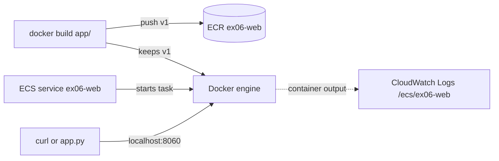

# Exercise 06 — Containers

| Level | Services | Time | Needs |
| --- | --- | --- | --- |
| 6 | ECR, ECS, IAM, CloudWatch Logs | 60–90 minutes | Docker, about 300 MB of free memory |

## Goal

Build a small web server image and push it to ECR. Run the image as an ECS
service with one task. Then call the container from your machine, and scale
the service from code.



## What you learn

- How to push an image to an ECR repository.
- How a task definition, a service, and a task work together.
- How `bridge` network mode maps a container port to a host port.
- Why a fixed host port allows only one task on each host.
- How to read container logs and the `stoppedReason` of a task.
- Where Floci differs from AWS: launch types, image pulls, port data, and logs.

## Before you start

1. Make sure the lab runs:

   ```bash
   mise run health
   ```

2. Go to this folder:

   ```bash
   cd floci-lab/exercises/06-containers
   ```

3. Make sure Docker has free memory:

   ```bash
   docker stats --no-stream
   ```

> **Note:** Floci runs each ECS task as a real Docker container on your
> machine. In this lab, the nginx task used less than 10 MiB of memory. The
> first build downloads the `nginx:alpine` image.

> **Note:** At the first ECR call, Floci starts the container
> `floci-ecr-registry`. This registry stores the images of all repositories. It
> stays when you delete your repositories.

---

## Part A — Explore with the AWS CLI

Push an image to ECR by hand. Then run it as one ECS task.

Use one terminal for all steps. Steps 1, 5, and 6 set the variables
`REPO_URI`, `TD_ARN`, and `TASK_ARN`. Later steps use them.

1. Create a repository. Keep its URI:

   ```bash
   REPO_URI=$(aws ecr create-repository --repository-name ex06-cli-demo \
     --query repository.repositoryUri --output text)
   echo "$REPO_URI"
   ```

   The output is `000000000000.dkr.ecr.us-east-1.localhost:4566/ex06-cli-demo`.

   > **Note:** On real AWS, the URI is
   > `<account>.dkr.ecr.<region>.amazonaws.com/<repository>`. Floci uses the
   > host `<account>.dkr.ecr.<region>.localhost:4566`. All names that end in
   > `.localhost` resolve to `127.0.0.1`.

2. Get the login password. Then log Docker in to the registry:

   ```bash
   aws ecr get-login-password
   aws ecr get-login-password | docker login --username AWS --password-stdin \
     000000000000.dkr.ecr.us-east-1.localhost:4566
   ```

   The first command prints `floci`. The second command prints
   `Login Succeeded`. Docker can also print a warning about unencrypted
   credentials.

   > **Note:** Floci always returns the password `floci`, and the lab registry
   > does not check it. On real AWS, the password is a token that expires after
   > 12 hours. Docker writes the login to `~/.docker/config.json`. Step 10
   > removes it.

3. Build an image from `nginx:alpine`, and push it to the repository.

   > **Note:** In this lab, `docker push` to the Floci registry fails with
   > `http: server gave HTTP response to HTTPS client`. The Docker engine sends
   > HTTPS to the registry, but the registry serves only HTTP. The option
   > `registry.insecure=true` of `docker build` pushes over HTTP. You do not
   > have to change the Docker settings.

   ```bash
   echo 'FROM nginx:alpine' | docker build --provenance=false \
     --output "type=image,name=$REPO_URI:v1,push=true,registry.insecure=true" -
   ```

   The last lines show `pushing manifest for ...ex06-cli-demo:v1`. The `-` at
   the end reads the Dockerfile from the pipe. `--provenance=false` stops the
   build attestation, so ECR stores one image manifest.

4. Look at the image in ECR:

   ```bash
   aws ecr describe-images --repository-name ex06-cli-demo \
     --query 'imageDetails[].[imageTags[0],imageSizeInBytes,imageManifestMediaType]' \
     --output table
   ```

5. Create a cluster. Then register a task definition that runs the image in
   `bridge` mode:

   ```bash
   aws ecs create-cluster --cluster-name ex06-cli-cluster --query cluster.status --output text
   cat > web.json <<EOF
   [{"name": "web", "image": "$REPO_URI:v1", "memory": 64, "essential": true,
     "portMappings": [{"containerPort": 80, "hostPort": 8061}]}]
   EOF
   TD_ARN=$(aws ecs register-task-definition --family ex06-cli-web --network-mode bridge \
     --container-definitions file://web.json \
     --query taskDefinition.taskDefinitionArn --output text)
   echo "$TD_ARN"
   ```

   In `bridge` mode, Docker publishes the container port `80` on the host port
   `8061`.

6. Run one task. Wait until it runs, then look at it:

   ```bash
   TASK_ARN=$(aws ecs run-task --cluster ex06-cli-cluster --task-definition "$TD_ARN" \
     --launch-type EC2 --query 'tasks[0].taskArn' --output text)
   aws ecs wait tasks-running --cluster ex06-cli-cluster --tasks "$TASK_ARN"
   aws ecs describe-tasks --cluster ex06-cli-cluster --tasks "$TASK_ARN" \
     --query 'tasks[0].[lastStatus,containers[0].networkBindings[0].hostPort]' --output text
   ```

   > **Note:** The `EC2` launch type runs tasks on container instances. On real
   > AWS, these are EC2 instances with the ECS agent. When the cluster has no
   > container instance, `run-task` returns a failure. Floci runs the task on
   > your Docker engine. Also, the task is `RUNNING` at once. On real AWS, a
   > task is `PROVISIONING` and `PENDING` first.

7. Find the container. Then call it:

   ```bash
   docker ps --filter "label=io.floci.resource-id=${TASK_ARN##*/}" --format '{{.Names}}  {{.Ports}}'
   curl -s http://localhost:8061/ | grep '<title>'
   ```

   The container name is `floci-ecs-<task-id>-web`. The page title is
   `Welcome to nginx!`.

   **Question:** In step 6, `describe-tasks` shows the host port `80`.
   `docker ps` shows `8061`. Which value is correct?

   > **Note:** Floci runs in a container in this lab. In this setup, Floci
   > reports the container port as the host port in `networkBindings`. Real AWS
   > reports the real host port. Here, use `docker ps` or the `hostPort` of the
   > task definition.

8. Read the container logs:

   ```bash
   aws logs tail /ecs/ex06-cli-web
   ```

   The output has the nginx start lines and one `GET /` line from step 7.

   > **Note:** This task definition has no `logConfiguration`. On real AWS, the
   > container logs then do not go to CloudWatch Logs. Floci always sends them
   > to the log group `/ecs/<family>`, and it creates the log group. Floci also
   > ignores the `awslogs-group` option.

9. Stop the task. Then look for the container again:

   ```bash
   aws ecs stop-task --cluster ex06-cli-cluster --task "$TASK_ARN" --reason "Part A is done" \
     --query 'task.[lastStatus,stoppedReason]' --output text
   docker ps -a --filter "label=io.floci.resource-id=${TASK_ARN##*/}" --format '{{.Names}}'
   ```

   The task is `STOPPED`. `docker ps -a` shows no name, because Floci removed
   the container.

10. Delete the resources and the files:

    ```bash
    aws ecs delete-cluster --cluster ex06-cli-cluster --query cluster.status --output text
    aws ecs deregister-task-definition --task-definition "$TD_ARN" \
      --query taskDefinition.status --output text
    aws ecs delete-task-definitions --task-definitions "$TD_ARN" \
      --query 'taskDefinitions[].status' --output text
    aws ecr delete-repository --repository-name ex06-cli-demo --force \
      --query repository.repositoryName --output text
    aws logs delete-log-group --log-group-name /ecs/ex06-cli-web
    docker logout 000000000000.dkr.ecr.us-east-1.localhost:4566
    rm web.json
    ```

    **Question:** Why does `delete-repository` need `--force` here?

---

## Part B — Build with OpenTofu

1. Initialize OpenTofu. The flag reuses the provider that the lab already
   downloaded:

   ```bash
   tofu init -plugin-dir=../../.terraform/providers
   ```

2. Open `main.tf`. Complete TODO 1 and TODO 2.
3. Apply the changes:

   ```bash
   tofu apply
   ```

4. Build the image in `app/` and push it to the new repository:

   ```bash
   REPO_URL=$(tofu output -raw repository_url)
   docker build --provenance=false \
     --output "type=image,name=$REPO_URL:v1,push=true,registry.insecure=true" app
   aws ecr list-images --repository-name ex06-web --query 'imageIds[].imageTag' --output text
   ```

   The last command prints `v1`.

   > **Note:** `docker build` also keeps the image `<repository URL>:v1` on
   > your Docker engine. Floci starts the task from this local image. It does
   > not pull the image from the registry. In this lab, a pull from the Floci
   > registry fails with the same HTTPS error as `docker push`. On real AWS, ECS
   > pulls the image from ECR with the execution role.

5. Complete TODO 3 to TODO 8. Preview the changes after each TODO:

   ```bash
   tofu plan
   ```

6. Apply the changes:

   ```bash
   tofu apply
   ```

7. Wait until the service runs its task. Then call the service:

   ```bash
   aws ecs wait services-stable --cluster ex06-cluster --services ex06-web
   curl -s "$(tofu output -raw service_url)" | grep '<h1>'
   ```

   The output is `<h1>Hello from ex06-web v1</h1>`.

8. Find the task container:

   ```bash
   docker ps --filter label=io.floci.service=ecs --format '{{.Names}}  {{.Ports}}'
   ```

   The output shows `0.0.0.0:8060->80/tcp`.

9. Read the container logs:

   ```bash
   aws logs tail /ecs/ex06-web
   ```

   The output has one `GET /` line for the request from step 7.

   > **Note:** With `awslogs-stream-prefix = "ecs"`, real AWS names the log
   > stream `ecs/web/<task-id>`. Floci names it `<date>/web/<task-id>`, for
   > example `2026/09/15/web/<task-id>`.

10. Run `tofu plan` again. It must show `No changes`.

---

## Part C — Use it from code

1. Open `app.py`. Complete TODO 1 to TODO 5.
2. Run the app:

   ```bash
   uv run --with boto3 python app.py
   ```

   The output must show `-> 200` and `Hello from ex06-web v1`. After the scale
   to 2, it must show a stopped task with `Bind for ...:8060 failed: port is
   already allocated`. At the end, the service has `desired=1 running=1`.

3. **Question:** Why can the second task not start? On real AWS, how can one
   host run two tasks of this service?

> **Note:** On real AWS, the scheduler does not put a task on a container
> instance that already uses the host port. The task does not start, and the
> service shows an event about the port. Floci starts the container, and Docker
> rejects the port. Floci tries again every 5 seconds. Each try adds one
> `STOPPED` task.

---

## Check your work

```bash
./check.sh
```

The checker reads the emulator and Docker, and it calls the container. It does
not read your files. All checks must show `PASS`.

---

## Clean up

1. Destroy the resources:

   ```bash
   tofu destroy
   ```

2. The command fails with `RepositoryNotEmptyException`. **Question:** OpenTofu
   deleted the other resources. Which objects in the repository did OpenTofu
   not create?

3. Fix the problem. Add `force_delete = true` to the repository, then apply and
   destroy again. The apply creates the other resources again, and the destroy
   deletes all of them:

   ```bash
   tofu apply
   tofu destroy
   ```

   > **Caution:** On a real account, `force_delete` deletes all images in the
   > repository without a second question. Use it for labs and test
   > repositories only.

4. Make sure that no task container is left. The command must show no names:

   ```bash
   docker ps -a --filter label=io.floci.service=ecs --format '{{.Names}}'
   ```

---

## Stretch goals

- Deploy a new version. Change `v1` to `v2` in `app/index.html`. Build and push
  the tag `v2`, then change the image tag in the task definition and apply.
  Call the service. Read the hint about the old page.
- Set `image_tag_mutability = "IMMUTABLE"` on the repository and apply. Change
  `app/index.html`, then push the tag `v1` again. Read the error message.
- With the CLI, run the image in `awsvpc` mode: register a task definition with
  `--network-mode awsvpc --requires-compatibilities FARGATE --cpu 256 --memory 512`,
  and run it with `--launch-type FARGATE`. Compare the `docker ps` output with
  `bridge` mode. Can you call the container from your machine?
- In `app.py`, print the last 5 log events of the running task. Find the log
  stream with `describe_log_streams`. Its name ends with `web/<task-id>`.

---

## Hints

<details>
<summary>tofu init fails: the provider is not in the plugin directory</summary>

The lab provider is not downloaded yet. Run `tofu init` in `floci-lab/` once,
or run `mise run install`. Then run the init command of this exercise again.

</details>

<details>
<summary>docker push fails with "server gave HTTP response to HTTPS client"</summary>

The Floci registry serves only HTTP. In this lab, `docker push` and
`docker pull` use HTTPS for the registry, and they fail. Push with
`docker build` and the option `registry.insecure=true`, as in Part A step 3.
Do not change the Docker settings.

</details>

<details>
<summary>docker build pushes the image, but list-images fails with RepositoryNotFoundException</summary>

The repository did not exist at the time of the push. The Floci registry
accepted the image anyway. Real AWS rejects a push to a repository that does
not exist. Complete TODO 1 and run `tofu apply`. In this lab, `list-images`
then showed the image without a second push.

</details>

<details>
<summary>The service has no running task, and curl fails</summary>

Read why the last task stopped:

```bash
aws ecs describe-tasks --cluster ex06-cluster \
  --tasks $(aws ecs list-tasks --cluster ex06-cluster --service-name ex06-web \
    --desired-status STOPPED --query 'taskArns[:100]' --output text) \
  --query 'sort_by(tasks, &stoppedAt)[-1].stoppedReason' --output text
```

- `failed to resolve reference ... server gave HTTP response to HTTPS client`:
  the image is not on your Docker engine, and Floci cannot pull it. Run the
  `docker build` command from Part B step 4. Floci tries again every 5 seconds.
  In this lab, the next try started the task.
- `Bind for ...:8060 failed: port is already allocated`: another container uses
  the host port. Find it with `docker ps`.

</details>

<details>
<summary>The task runs, but curl fails with "Failed to connect to localhost port 8060"</summary>

Docker did not publish the port. Find the task container:

```bash
docker ps --filter label=io.floci.service=ecs --format '{{.Names}}  {{.Ports}}'
```

When `Ports` shows only `80/tcp`, the port mapping has no `hostPort`. Set
`hostPort = 8060` in the port mapping, then apply. On real AWS, a missing host
port in `bridge` mode gets a random host port. Floci does not publish the port.

</details>

<details>
<summary>tofu apply does not end: aws_ecs_service "Still creating..."</summary>

The service has `wait_for_steady_state = true`. The provider then waits for
data about the deployment that Floci does not send. In this lab, the apply
still waited after 90 seconds, while the service ran its task. Remove the
setting. Wait with `aws ecs wait services-stable` instead.

</details>

<details>
<summary>Stretch goal: the service still serves the old page after tofu apply</summary>

The new task needs host port `8060`, but the old task still uses it. The new
task stops with `port is already allocated`, and the old task keeps running.
Stop the old task first. Scale the service to 0, then back to 1:

```bash
aws ecs update-service --cluster ex06-cluster --service ex06-web --desired-count 0
aws ecs wait services-stable --cluster ex06-cluster --services ex06-web
aws ecs update-service --cluster ex06-cluster --service ex06-web --desired-count 1
aws ecs wait services-stable --cluster ex06-cluster --services ex06-web
```

The desired count is 1 again, so `tofu plan` shows no changes.

> **Note:** On real AWS, `deployment_minimum_healthy_percent = 0` lets ECS stop
> the old task before it starts the new task. In this lab, Floci started the
> new task first also with this setting, and the new task stopped with the same
> port error.

</details>

<details>
<summary>check.sh: "A task of ex06-web stopped with 'port is already allocated'" fails</summary>

Run Part C. The checker looks for the failed start that `app.py` causes. It
counts only the tasks since the service was created. After `tofu destroy` and
`tofu apply`, run Part C again.

</details>

<details>
<summary>check.sh: "Repository ex06-web has the image tag v1" fails</summary>

Run the `docker build` command from Part B step 4. The tag must be `v1`.

</details>

---

## Solution

Try the exercise first. The solution is in [`solution/`](solution/).

To run the solution, destroy your own resources first. Both use the same names.
The first apply creates only the repository. OpenTofu prints a warning about
`-target`.

```bash
cd solution
tofu init -plugin-dir=../../../.terraform/providers
tofu apply -target=aws_ecr_repository.web
docker build --provenance=false \
  --output "type=image,name=$(tofu output -raw repository_url):v1,push=true,registry.insecure=true" app
tofu apply
aws ecs wait services-stable --cluster ex06-cluster --services ex06-web
uv run --with boto3 python app.py
../check.sh
tofu destroy
```
